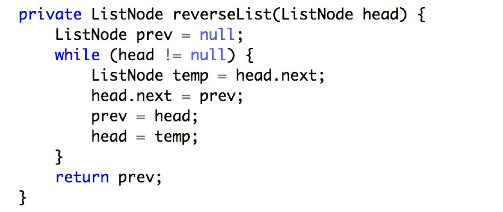
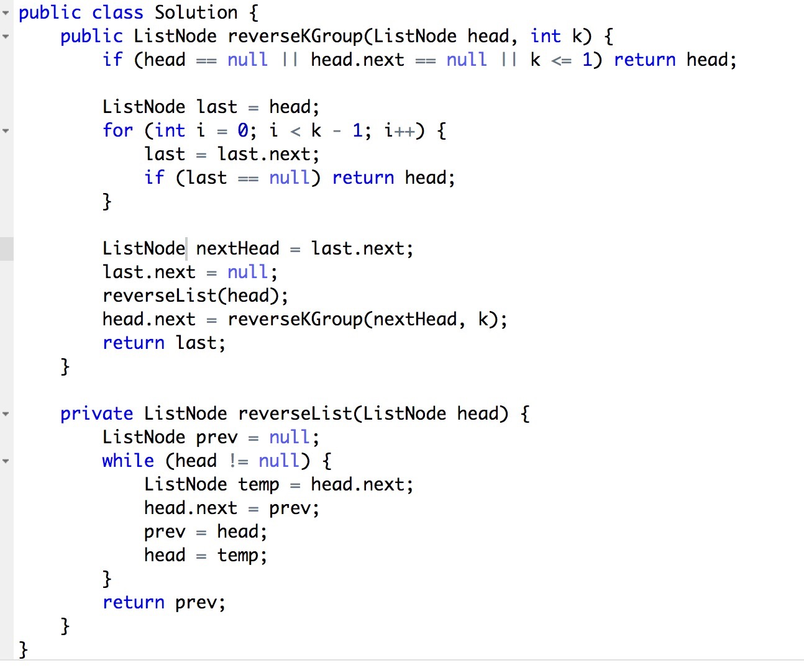
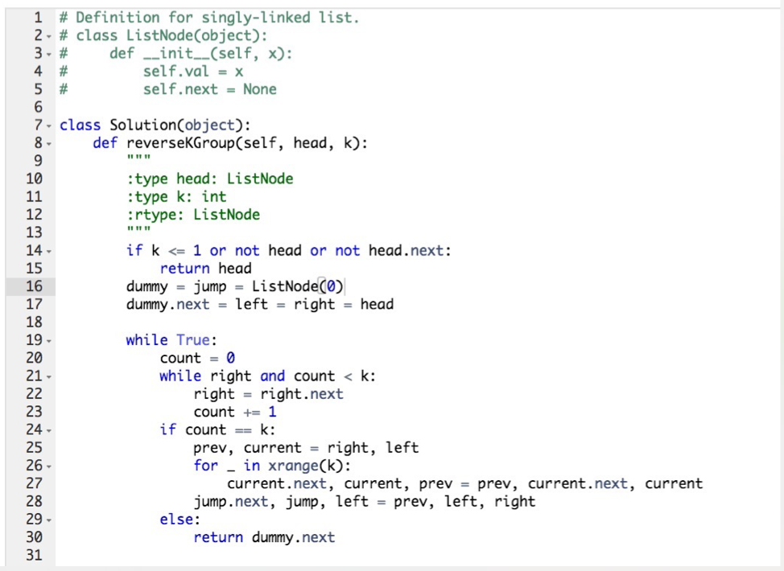
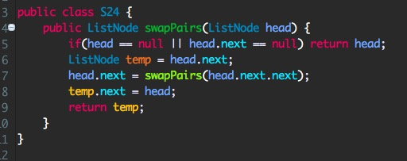
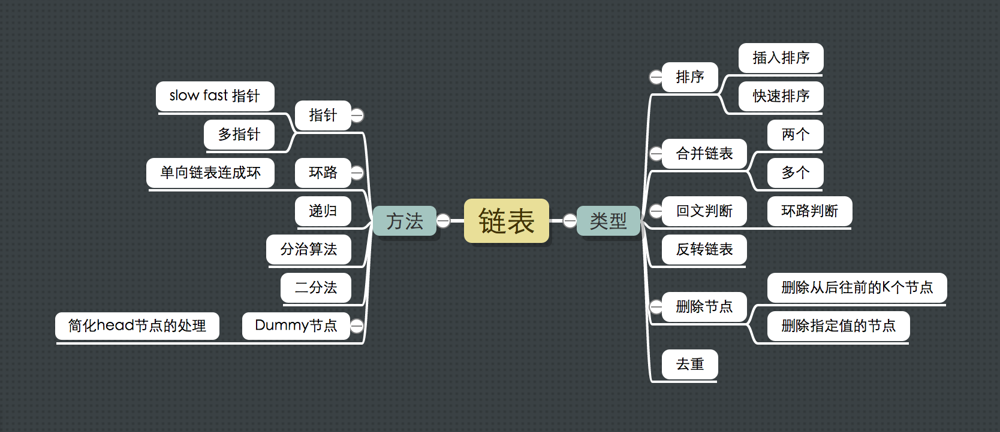

## 25. Reverse Nodes in k-Group

> Given a linked list, reverse the nodes of a linked list k at a time and return its modified list.
> 
> k is a positive integer and is less than or equal to the length of the linked list. If the number of nodes is not a multiple of k then left-out nodes in the end should remain as it is.
> 
> You may not alter the values in the nodes, only nodes itself may be changed.
> 
> Only constant memory is allowed.
> 
> For example,
> Given this linked list: 1->2->3->4->5
> 
> For k = 2, you should return: 2->1->4->3->5
> 
> For k = 3, you should return: 3->2->1->4->5
> 

## 题目解析

> 这道题的难度是 Hard, 是对我们这一周链表练习的一次检测。

题目的意思是要我们将一个链表分成 n / k 个部分，如果 n / k > k 那么则翻转。举了一个例子:
> k = 2, linked: 1 -> 2 -> 3 -> 4 -> 5 

上面的链表可以分成 3 个部分:  `1 -> 2, 3 -> 4, 5 `:
- 翻转 `1 -> 2` 得 `2 -> 1`
- 翻转 `3 -> 4` 得 `4 -> 3`
- 因为 5 只有一个节点，不需要翻转
最后答案: `2 -> 1 -> 4 -> 3 -> 5`

由上面的分析，我们将这个复杂的问题分成两个子问题:
- 链表如何分组?
- 链表如何反转? 

### 链表如何分组?
分组的思路很简单: 用一个数字标记当前节点的位置。

```ruby
  count = 1
  while head && count < k do
    head = head.next
    count += 1
  end
```

上面的代码非常容易的获取链表的前 k 个节点，结合递归或者循环，就能非常容易的分组了。

### 链表如何反转?
反转的思路: 两个指针: 当前指针 和 前指针 ，通过不断的操作指针的节点和指针来反转链表。



## 收录的部分代码

@fzy 提交的 Java 代码: 思路非常清晰，代码简洁。



@Gerrold_Gao 提交的 python 代码: 简洁，链表反转只有一行代码



## 相关issue
> https://leetcode.com/problems/swap-nodes-in-pairs

这道题只是中等难度，只是本题的k = 2的一种特殊情况。 @小小鹅 的解决方案特别的好，所以也记录下来。




## 链表问题的总结



链表问题考察最多的是对指针的灵活运用。比如交换链表的位置，递归，排序等问题，都需要我们熟练的使用指针。有时候画一张简单的图可以简化我们的思考，帮助我们找到可能的方案。
下面总结的问题和方法都是非常经典的，可以作为学习链表的大纲。

链表问题可以归为如下几种类型:
- 排序
- 合并链表
- 回文判断
- 反转链表
- 删除节点
  - 删除从后往前的某个节点
  - 删除某个值
- 去重

解题方法有:
- 指针
  - slow-fast 指针
  - 多指针
- 环路: 将单向链表连接成环
- 递归
- 二分法
- 分治算法
- Dummy 节点: 简化对head节点的处理

